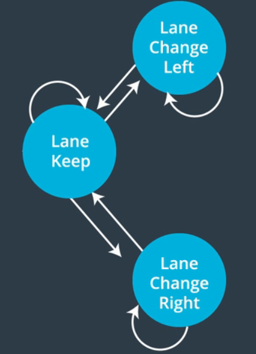

## **Path Planning Project**
The goal of this project is to build a path planner able to create smooth and safe paths for a car. The implementation of this path planner will allow the car to drive in a 3-lane highway with traffic; all by using localization, sensor fusion, and map data.

Specific  [Rubric Points](https://review.udacity.com/#!/rubrics/1020/view) include:

* The car is able to drive at least 4.32 miles without incident.
Driving without 'Incidents' implies:
	* The car does not exceed maximum acceleration or jerk limits.
	* The car stays in its lane, except for the time between changing lanes.
	* The car does not have collisions.
	* Finally, the car is able to change lanes.
* The code should compile with `cmake` or `make` without errors.

[//]: # (Image/Video References)
[vi01]: ./video.mp4

---

### Files Included:
Here I list the files I modified to complete this project:

* `src/main.cpp:` The main file of the project. Here we define all the helper functions that give us possible states, compute costs and state transition functions, and generate plausible trajectories for the car around the track. Also, the interaction with the simulator takes place here. 
* `src/spline.h:` Header file for the implementation of a [cubic spline interpolation library](http://kluge.in-chemnitz.de/opensource/spline/).
* `./writeup.md:` You're reading it!
* `./video.mp4:` A video showing the vehicle driving a lap around 
the track for more than 4.7 miles.

--- 

### Running the Code:

The code was implemented in CLion / Ubuntu 18.04 LTS.

To execute, do: `cmake-build-debug/./path_planning`. Then, start the Term 3 simulator, and click on 
Project 1: Path Planning. 

---

### Reflection on the Project:

#### 0. Implemented Strategy

As seen in the classroom Path Planning lessons, fast sampling modules like Sensor Fusion feed Prediction, and both Prediction and Localization are inputs for the (low frequency) Behavior Planner. This arquitecture answers the question of what manouvers the car should perform, and thus the Trajectory Planner is the final module in charge of executing these manouvers safely.

In this Project we develop a Path Planner almost in the opposite order of what was just described: 

* First we concentrate in getting the car to drive in its lane with smooth trajectories.
* Then we build a Behavior Planner, and develop a set of states that can drive the car in a highway by changing lanes.
* Next, we need to account for what other vehicles are doing, and predict where they will be in a given horizon time. 
* Finally, our car pass slower moving traffic by computing a cost function for each candidate trajectory (state). Minimization (maximization) of the cost triggers a state transition that either keeps our car in its lane, or changes it to the right (left) lane.

We'll go into the aforementioned points in detail below. 

****IMPORTANT**** I adopted a functional approach for this project's code, so all line references are made with respect to `src/main.cpp`.

#### 1. Trajectory Generation

To make our car stay in its lane we make extensive use of Frenet coordinates (`s` and `d`), and the `getXY() ` function to actually generate points in the global coordinates of the simulator map. The car will visit these points sequentially every 0.02 seconds.

The strategy here will prove useful not only to generate a trajectory, but also to maintain a given speed of the car in this path. We begin by creating a set of five anchor points in Frenet coordinates. The first two specify a line tangent to the direction of the car, while the last three are widely spaced at 30m and are parameterized by `s` and a proxy for `d` given by the lane number (this makes both straight and lane changing paths possible within this approach without code modifications). 

After transforming  to the car's system of reference (leaving us at the origin), we create a [spline object](http://kluge.in-chemnitz.de/opensource/spline/) and add the anchor points to it. Then we interpolate between the sparcely spaced points with the spline and fill with more points, such that the speed is controlled to a value just under the speed limit (49.5 mph). Then we rotate back to global coordinates to pass 50 (x, y) points to the simulator.

An improvement to make the car's trajectory smoother is to constantly "recycle" the previous path's points. This means we don't need to predict 50 (x,y) coords in each iteration of the code, but instead we start with all of the previous path points (i.e. whatever path is left from the previous iteration that the car didn't travel)), and then fill out the rest of our path planner as described above such that we always output a trajectory of 50 points.

The process described in this item is implemented in the function `generateTrajectory()` (lines `174-290`).

#### 2. Behavior Planner Intro

We choose a Finite State Machine (FSM) representation for our system, as they are straightforward conceptually, and are easy to maintain. An FSM makes decisions based on a finite set of discrete states, but in this Section we will just descibe the simplest implementation for a self driving car (bare minimum) where we define three possible states:

| States |  Abbreviation in the code   |
|:----:|:--------:|
| Lane Keep | KL |
| Lane Change Left | LCL |
| Lane Change Right | LCR |

A graphical representation for our Car in a Highway FSM is given by:

where the start state is KL (Lane Keep) and there are no accepting states. The accesible states for our car at any given time will be defined for what lane it is occupying. This is implemented in the function  `getPossibleStates()` (lines `384-398`).  In the same way, the pure transition (but not what triggers it) to another state as represented by the arrows in the prior graph is carried out by the `chooseNextState()` function,  lines:`463-479`.

#### 3. Prediction and Lane Change Logic

From Sensor Fusion we have information on the positions (Frenet coordinates) and (vx, vy) velocity components of other cars in the road. With these we can predict where these cars will be in a given horizon time, and thus minimize the risk of collisions ahead. 

By projecting our car's `s` coordinate into the future (at the final point of the previous path given by the simulator) and projecting, in the same way, the sensor fusion data we receive from other cars:

   	s += (double) prev_size * 0.02 * v;
            
we can define proximity within a certain `s` gap (parameter). The other cars might be in the  same or an adjacent lane (this does not matter for the `s` coordinate). Therefore we can derive a logic for when we have to brake to avoid collision ahead, but also for when we can (or not) change lanes. Boolean flags are designated for the proximity of other cars

            bool ahead_flag;        // flag, proximity ahead
            bool left_flag;         // flag, proximity within a gap (ahead & behind) the left lane
            bool right_flag;        // flag, proximity within a gap (ahead & behind) in the right lane
            bool emerg_flag;        // Proximity in a stringent gap. Imminent collision.

The function `detectCarProximity()` in lines `293-381` is called in each iteration of the program and combines sensor fusion data of position and velocities with several `if-else` statements to raise a flag in the case of proximity of other cars. When these flags are true, e.g. `left_flag=True`, a lane change to the left is *immediately inhibited*, even if that is the preferred transition dictated by the minimization of our cost functions (more below). In other cases, for example when we are in the KL state, an `ahead_flag` will lead to deaccelerating, or when there's a emergency flag indicating close proximity of another car, we will be compelled to strong (de)acceleration to avoid collision, depending if it approaches from behind or in front of us.

In a way, the boolean logic delivered by `detectCarProximity()` does not only *avoid collisions* but acts as a proxy of a system with more states, like `Lane Change R/L Prepare`.

#### 4. Cost Functions and State Transitions

The goal in this Project is to pass slower moving traffic to complete the track as fast as possible (but within the 50 mph speed limit). Therefore we need a cost function that considers speed and how to maximize it within the law boundary.

We also need to not exceed maximum acceleration or jerk limits, and thus our cost function need to consider this as well. This problem could be approached with quintic polynomials and Jerk Minimization Trajectories (JMT) as seen in the classroom, but we follow the anchor points/spline strategy explained earlier.

In the implementation explained here, our car will always try to go at the reference speed, unless a `flag_ahead` occurs. In that case, it will try to pass the slower moving traffic. How? Depending on what lane it is, it will have other states available (see Section 2). Each of these states represent a different trajectory, and each of these trajectories has an associated cost according to the velocity/acceleration criteria described above. This is what we compute in the function `getCosts()` (lines `417-460`). We want to minimize the acceleration (mostly normal acc., to make the passengers as comfortable as possible) while making the speed close to the limit. This is the output of the `getTransition()` function (lines `401-414`) which is the trigger for the FSM to change its state.

Given the flags delivered as an output by the `detectCarProximity()`, and the next state transition obtained from the computation of costs for several candidate trajectories, the`actionNextState()` function (lines `481-531` actuates the FSM, whether its output is to keep lanes, change lane left, or change lane right.
 

#### 5. Simulation

Here's a [link to my video result][vi01], with the car driving around the track at a reference speed of 49.5 mph. The green line represents the trajectory generated by the path planner for an horizon of one second. The car goes for more than 4.7 miles without registering any incident.

